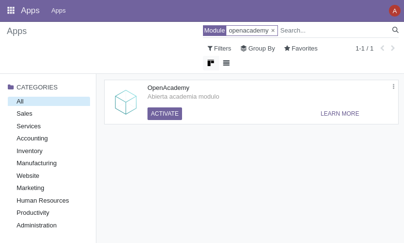
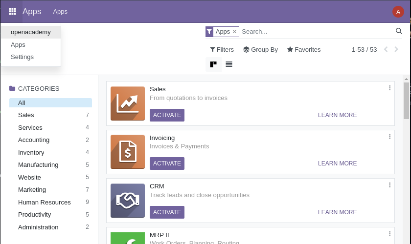
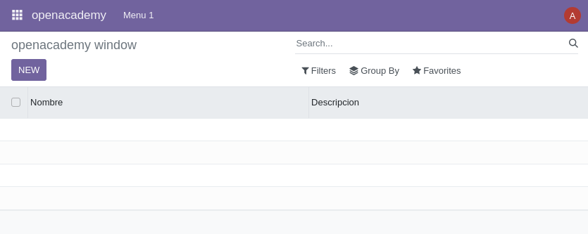
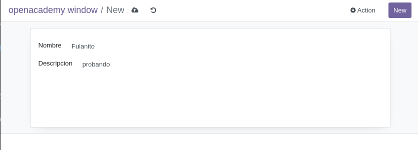
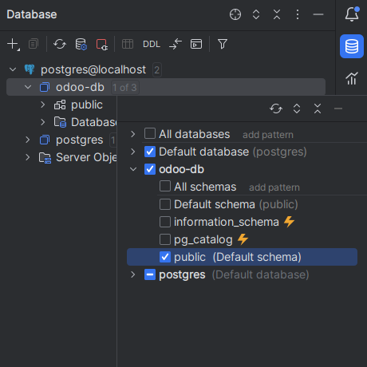
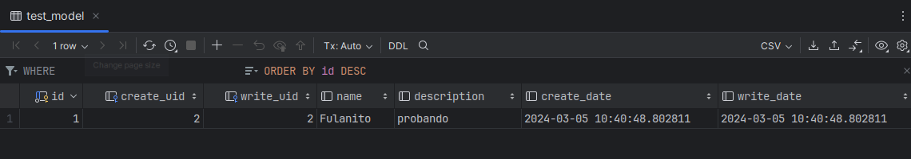

# Creacion modulo Odoo

Esta guía tratará sobre como crear desde cero un módulo personalizado en Odoo que use Python como lenguaje.

## Comenzamos
Para empezar debermos levantar nuesto Odoo, en nuestro caso usaremos Docker para crear dos contendores, uno para Odoo y otro para nuestra base de datos (Postgres).

Necesitamos que se cree con una carpeta dedicada que será la que contenga nuestro modulo.
La llamaremos `extra-addons`.

Con la línea de codigo `extra-addons` vinculamos nuestra carpeta de a una dentro del contenedor.

```yaml
  # odoo:
  web:
    image: odoo:16.0
    depends_on:
      - mydb
    volumes:
      - ./extra-addons:/mnt/extra-addons
    ports:
      - "8069:8069"
    environment:
      - HOST=mydb
      - USER=odoo
      - PASSWORD=odoo
```

Una vez creado nos metemos dentro del contendor (necesita estar en funcionamiento).
```
docker exec -u root -it "ID-del-container-de-odoo" /bin/bash;
```

Una vez dentro vamos a nuestra carpeta `extra-addons`.
```
cd /mnt/extra-addons
```

Allí **creamos nuestro módulo**. Para ello usamos el comando especificando el nombre del módulo que queremos crear, en nuestro caso 'openacademy'.
```
odoo scaffold openacademy
```
Para poder trabajar con él necesitamos darle permisos a los archivos del módulo.
```
chmod -R 777 openacademy/
```
> [!TIP]  
> Para comprobar que tenemos los permisos adecuados podemos ejecutar el comando `ls -l` y en los ficheros `py` deberian 
aparecen los siguientes permisos: `-rwxrwxrwx`

## Modificar el módulo

Una vez creado nuestro módulo pasaremos a configurarlo.

En `__manifest__.py` podremos cambiar el nombre, descripción, autor... que aparecerán en la web al buscar el módulo.

```python
    'name': "OpenAcademy",

    'summary': """
        Abierta academia modulo""",

    'description': """
        Abierta academia modulo por Samuel Gardón Prieto
    """,

    'author': "Samuel",
    'website': "https://www.yourcompany.com",

    # Categories can be used to filter modules in modules listing
    # Check https://github.com/odoo/odoo/blob/16.0/odoo/addons/base/data/ir_module_category_data.xml
    # for the full list
    'category': 'Uncategorized',
    'version': '0.5',
```
Añadido a eso podremos cambiar la **versión** de este, cosa que tendremos que cambiar cada vez que hagamos un cambio para asegurarnos que se suba correctamente.

### Crear modelo

En la carpeta `model` cambiaremos el nombre al archivo `model` a `test_model` y modificaremos el archivo para crear nuestra tabla.

```python
from odoo import fields, models

class TestModel(models.Model):
    _name = "test_model"
    _description = "Test Model"

    name = fields.Char(string="Nombre")
    description = fields.Text(string="Descripcion")
```
Este código está creando una tabla llamada `test_model` con dos campos, `name` y `description`.

## Crear vista

Para crear una vista de la tabla iremos al archivo `views.xml` de la carpeta `views` y haremos las siguientes modificaciones:

---

```xml
<record model="ir.ui.view" id="openacademy.list">
  <field name="name">openacademy list</field>
  <field name="model">test_model</field> 
  <field name="arch" type="xml">
    <tree>
      <field name="name"/>
      <field name="description"/>
    </tree>
  </field>
</record>
```
* Descomentar en caso de que esté comentado 
* Cambiar `<field name="model"` por **el nombre de nuestra tabla**, en nuestro caso `<field name="test_model"`.
* En la etiqueta `<tree>` poner nuestos campos como `<field>`. Ej : `<field name="name"/>
      <field name="description"/>`

---

```xml
<record model="ir.actions.act_window" id="openacademy.action_window">
  <field name="name">openacademy window</field>
  <field name="res_model">test_model</field>
  <field name="view_mode">tree,form</field>
</record>
```
* Cambiamos `<field name="res_model">` por el nombre de nuestra tabla. Ej: `<field name="test_model">`.

---

```xml
<!-- Top menu item -->

<menuitem name="openacademy" id="openacademy.menu_root"/>

<!-- menu categories -->

<menuitem name="Menu 1" id="openacademy.menu_1" parent="openacademy.menu_root"/>
<menuitem name="Menu 2" id="openacademy.menu_2" parent="openacademy.menu_root"/>

<!-- actions -->

<menuitem name="List" id="openacademy.menu_1_list" parent="openacademy.menu_1"
        action="openacademy.action_window"/>
```
* Descomentamos `top menu item`, `menu categories` y 1 `action`.

---

### Cambiar permisos de vista

El ver nuestra vista tiene que ser configurado. Para ello en la carpeta `security` modificaremos el archivo `ir.model.acess.csv`. Cambiaremos la segunta línea:
```csv
access_openacademy_openacademy,openacademy.openacademy,model_test_model,base.group_user,1,1,1,1
```
Cambiaremos `model_openacademy` a `model_NUESTRA-TABLA`. EJ: `model_test_model`.

Y **por último** en el archivo `__manifest__.py` descomentaremos la siguiente línea de código.

```python
      'data': [
          'security/ir.model.access.csv', # Esta línea
      ],
```

## Instalar el módulo

Cambiaremos la version de `__manifest__.py` antes de proseguir.
Una vez hecho eso haremos restart de nuestro contenedor.
```
docker compose restart
```
En Odoo, borramos el filtro de 'Apps' y buscaremos nuestro módulo.



> [!IMPORTANT]  
> En caso de haber instalado el módulo previamente a los cambios tendremos que actualizarlo para disponer de ellos. Para ello hacer click en los tres puntos y en 'Upgrade'.



Una vez hecho esto sí nos vamos a la parte superior izquierda deberia salirnos un acceso a nuestro módulo.



Dentro de esta vista podremos modificar campos de la tabla, añadir campo, borrar...



Ejemplo de creación de usuario.

## Ver la base de datos desde el IDE

Para poder acceder a la base de datos desde nuestro IDE (PyCharm) debemos seguir los siguientes pasos.

En la parte derecha de nuestro IDE tenemos una ventana  `Database` en la que podremos añadir una conexión a una base de datos haciendo clic en el icono de `+`
Seleccionamos nuestro tipo de base de datos, añadimos la base de datos asignada a Odoo y seleccionamos la tabla `public` si no está seleccionado.



Una vez hecho esto, entraremos en la carpeta de esta base de datos `base-de-datos/public/tables/nuestra-tabla`
EJ: `odoo-db/public/tables/test_model`.

Con esto podremos ver los campos de esa tabla:



